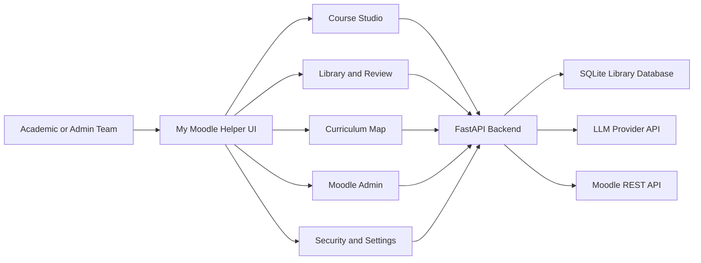
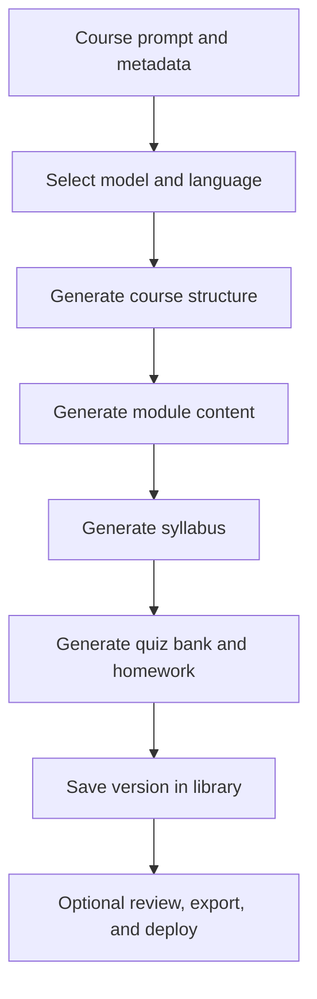
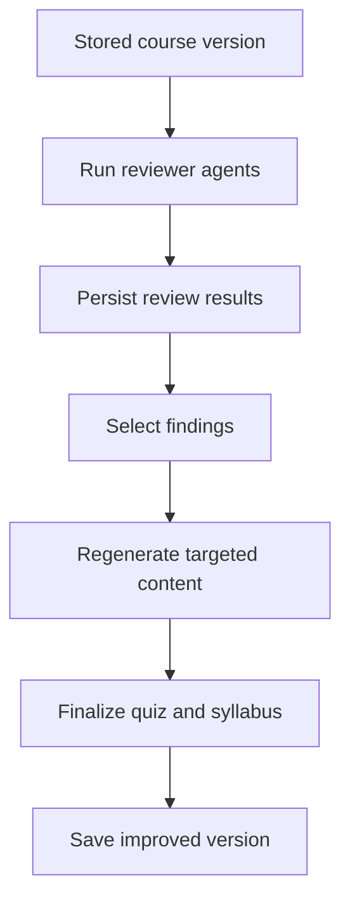
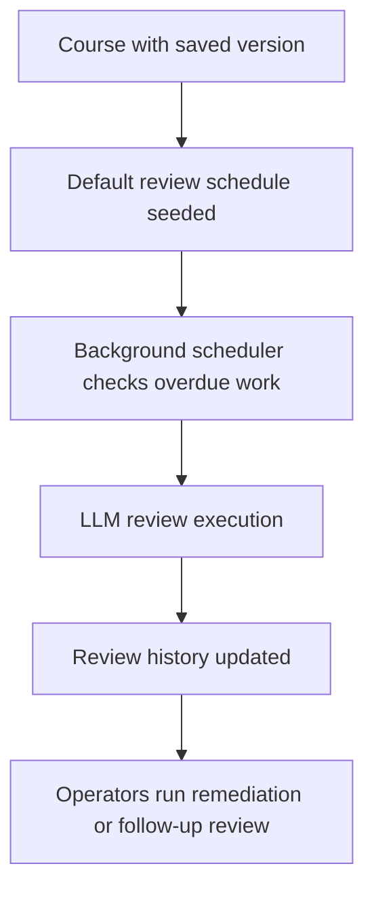
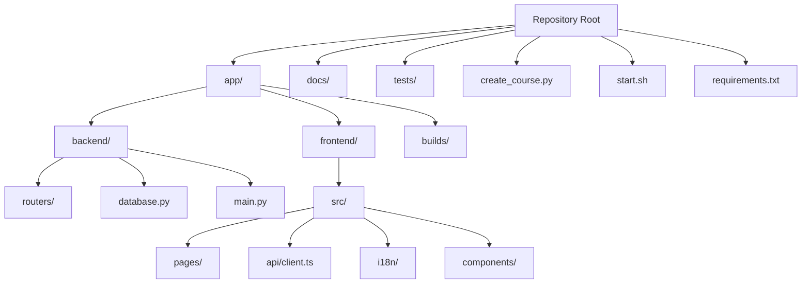

# My Moodle Helper

> AI-powered Moodle course operations and authoring platform for theological schools, seminaries, and admin teams.

[](LICENSE)
[](https://www.python.org/)
[](https://nodejs.org/)
[](https://react.dev/)
[](https://fastapi.tiangolo.com/)
[](https://moodle.org/)

My Moodle Helper combines course generation, library management, quality review, curriculum analytics, Moodle administration, and deployment into a single full-stack workspace. It can generate complete Moodle `.mbz` backups from a prompt, import existing courses, audit academic quality with LLMs, and support admin-first operational workflows such as user, enrollment, and security oversight.

The platform is built for teams that want local-LLM flexibility, versioned course assets, and practical Moodle administration without custom Moodle plugins or CLI access.

## Why This Exists

Most Moodle tooling is split across separate systems: authoring, QA, deployment, reporting, and site administration. My Moodle Helper brings those workflows together so an academic or operations team can:

- generate or import structured courses quickly,
- review and improve them with AI-assisted workflows,
- deploy them to Moodle safely,
- monitor curriculum coverage across the library,
- run scheduled re-reviews over time,
- and manage sensitive admin actions with audit visibility.

## Core Capabilities

### Course Authoring

- End-to-end LLM course generation: structure, modules, syllabus, quiz bank, and optional homework.
- Multi-language generation for Spanish, English, Portuguese, French, and German.
- Per-module regeneration with custom instructions.
- HTML and Word export for offline review and print workflows.
- Moodle `.mbz` build pipeline for portable course delivery.

### Library And Review Operations

- Versioned course library with fork, compare, and rollback-style workflows.
- Autonomous review against configurable expert agents.
- Review-driven regeneration for modules, quizzes, and syllabus updates.
- Scheduled reviews with overdue execution and persistent review history.
- Curriculum mapping with AI-scored domain coverage across the library.

### Moodle Administration

- Multi-instance Moodle connection management.
- Live deploy to Moodle with deployment history.
- Moodle catalog browsing, analytics, and import.
- Admin user, enrollment, and role assignment operations.
- Security diagnostics, audit trails, write-rate limiting, and retention controls.

## Product Overview



More diagrams are available in [docs/ARCHITECTURE.md](docs/ARCHITECTURE.md).

## Key Workflows

### 1. Generate A New Course



### 2. Review And Improve Existing Content



### 3. Continuous Quality Operations



## Tech Stack

| Layer | Technology | Notes |
| ----- | ---------- | ----- |
| Frontend | React 18 + Mantine 7 + Vite 6 | TypeScript SPA for admin and authoring workflows |
| Backend | FastAPI + Pydantic | REST API, orchestration, auth middleware |
| Database | SQLite | Single-file operational store for library, reviews, deploys, audits, and schedules |
| AI | OpenAI-compatible APIs | Works with LM Studio, Ollama, OpenAI, OpenRouter, Anthropic-compatible endpoints |
| Moodle Integration | Moodle REST webservices | Deploy, catalog, analytics, user, enrollment, and admin actions |
| Packaging | Moodle `.mbz` backup output | Portable course import format for Moodle 5.x |

## Repository Structure



## Quick Start

Full operational guidance lives in [docs/HOWTO.md](docs/HOWTO.md).

### Prerequisites

| Requirement | Minimum | Notes |
| ----------- | ------- | ----- |
| Python | 3.11 | 3.12+ recommended |
| Node.js | 20 LTS | includes npm |
| LLM server | optional but recommended | LM Studio, Ollama, or any OpenAI-compatible API |
| Moodle | 5.x | required for live deployment and admin operations |
| SQLite | built in | app database is created automatically |

### Install

```bash
git clone https://github.com/ricardojjulia/my-moodle-helper.git
cd my-moodle-helper

python3 -m venv .venv
source .venv/bin/activate
pip install -r requirements.txt

npm install
```

### Run In Development

```bash
source .venv/bin/activate
uvicorn app.backend.main:app --reload --port 4100
```

In a second terminal:

```bash
npm run dev
```

Open `http://localhost:4101`.

### Run In Production Mode

```bash
npm run build
source .venv/bin/activate
uvicorn app.backend.main:app --host 0.0.0.0 --port 4100
```

Open `http://localhost:4100`.

## Documentation Map

- [docs/HOWTO.md](docs/HOWTO.md): installation, configuration, Moodle token setup, operational usage.
- [docs/ARCHITECTURE.md](docs/ARCHITECTURE.md): system structure, component boundaries, and workflow diagrams.
- [CHANGELOG.md](CHANGELOG.md): release history and current unreleased work.

## License

This repository is publicly licensed under the [MIT License](LICENSE). You can use, modify, and distribute the software under the terms in that file.

## Current Status

My Moodle Helper is already usable as a practical internal tool for course generation, review, and Moodle admin operations. The current codebase includes:

- admin-first navigation and operational screens,
- curriculum mapping and scheduled review automation,
- contract and security tests around high-risk endpoints,
- CI checks for backend and frontend,
- and documented security operating modes for single-admin and team-admin deployments.

## Contributing

Pull requests are welcome. Keep changes focused, include clear rationale, and prefer tests for behavior changes.
