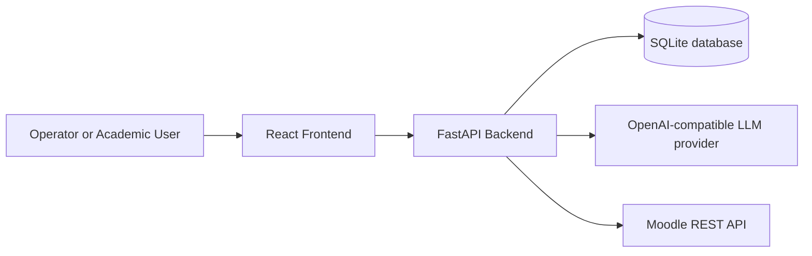
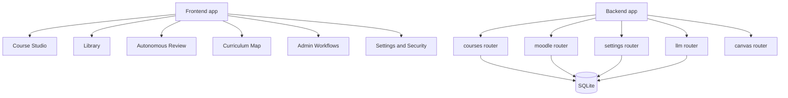
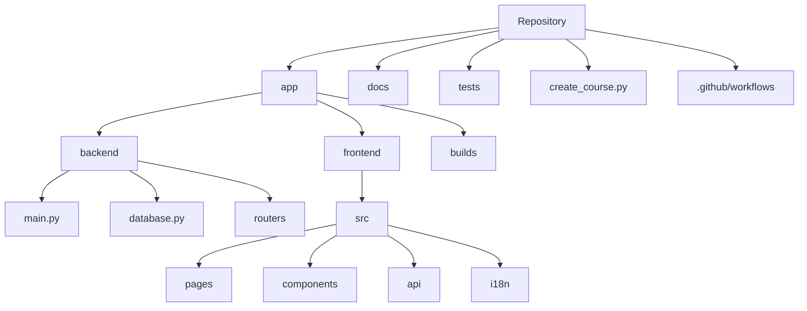
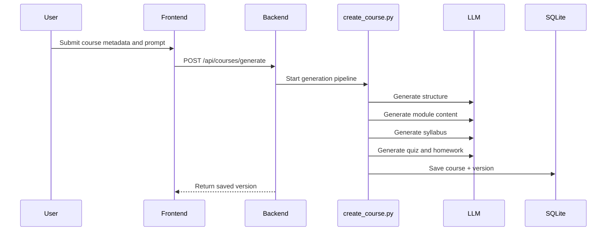
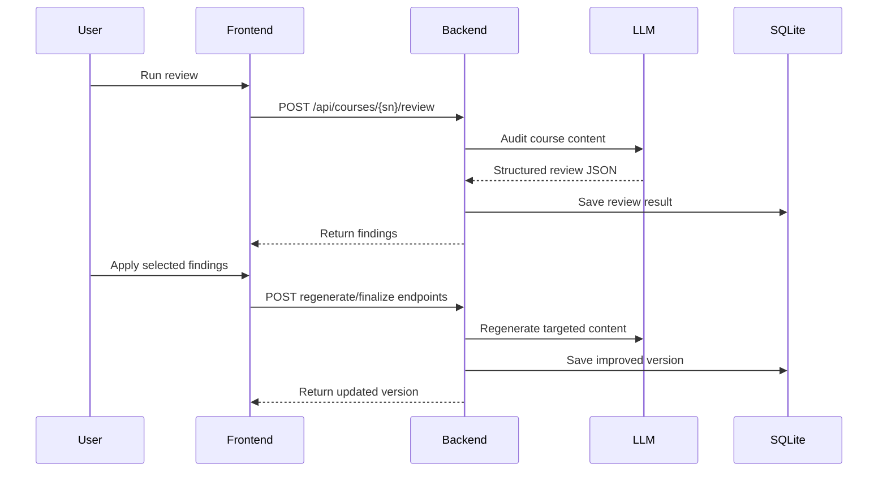
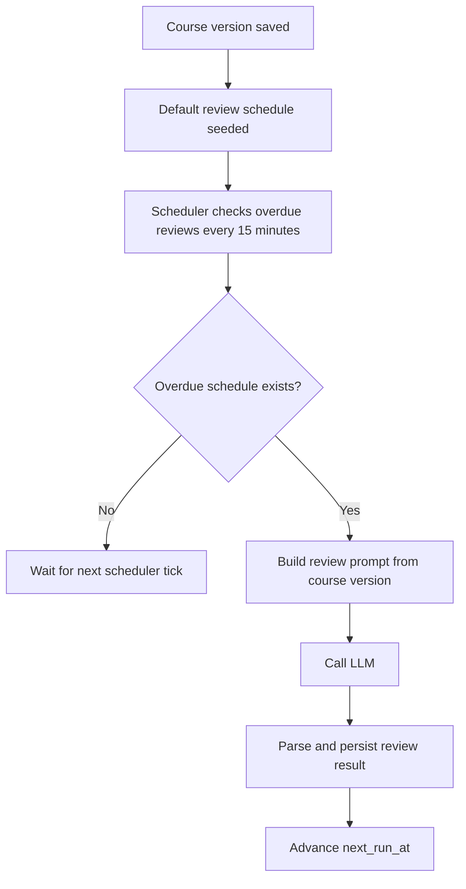
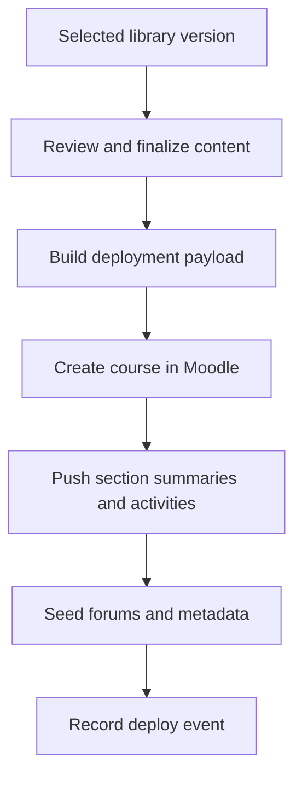
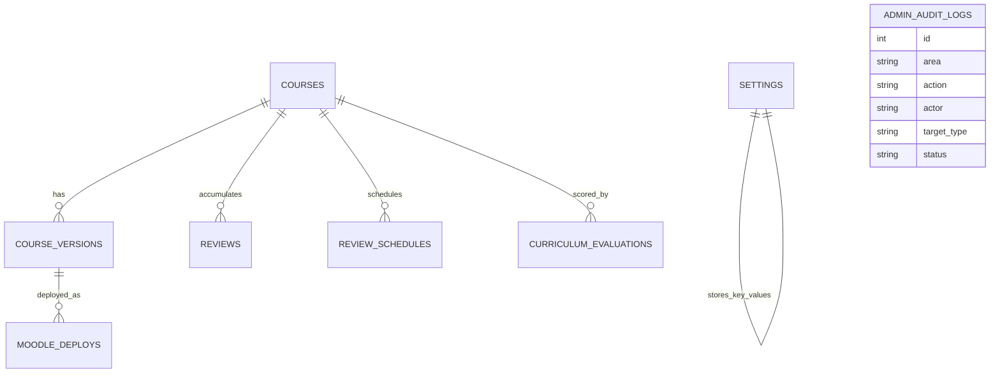

# Architecture

This document gives a high-level technical view of My Moodle Helper: repository structure, runtime architecture, and the main operational workflows.

## System Architecture

## Application Components

## Repository Structure

## Course Generation Workflow

## Review And Remediation Workflow

## Scheduled Review Workflow

## Moodle Deployment Workflow

## Data Model Overview

## Operational Notes

- The backend is the control plane: every authoring, review, curriculum, deployment, and admin workflow passes through FastAPI.
- SQLite is intentionally used as the single operational store to keep setup simple for local and small-team deployments.
- Scheduled reviews only execute while the backend process is running.
- Security-sensitive Moodle admin writes are audited and rate-limited.
- LLM providers are interchangeable as long as they expose an OpenAI-compatible interface.
